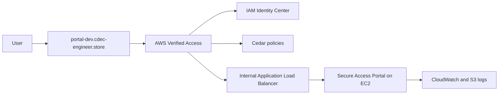

# Architecture Diagrams

```mermaid
flowchart LR
    User --> DNS[portal-dev.cdec-engineer.store]
    DNS --> VA[AWS Verified Access]
    VA --> IdC[IAM Identity Center]
    VA --> Cedar[Cedar policies]
    VA --> ALB[Internal Application Load Balancer]
    ALB --> App[Secure Access Portal on EC2]
    App --> Logs[CloudWatch and S3 logs]
```
